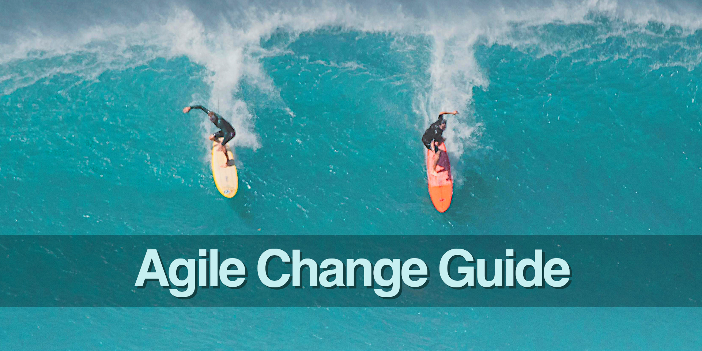

<!--
* browser: agile-change-guide
* tracker: cc7ca906a39d999812c39a08f107ddb3
* version: 1.0.0
* updated: 2023-07-26T10:54:04Z
* contact: Joel Parker Henderson (http://joelparkerhenderson.com)
* options: commentable
-->

# Agile Change Guide

Agile Change Guide: this book explains one topic per page, like a big glossary, easy wiki, quick encyclopedia, or summary notes.

- Get the book:
  [Free EPUB](https://github.com/SixArm/agile-change-guide/raw/main/agile-change-guide.epub),
  [Free PDF](https://github.com/SixArm/agile-change-guide/raw/main/agile-change-guide.pdf),
  [Gumroad](https://gumroad.com/l/agile-change-guide).
- Edited by [Joel Parker Henderson](https://github.com/joelparkerhenderson)
- For questions and suggestions [email me](mailto:joel@joelparkerhenderson.com)

## Contents

### [Introduction](topics/agile-change-guide-introduction)

- [What is agile?](topics/what-is-agile)
- [What is agile change management?](topics/what-is-agile-change-management)
- [Who is the customer and what do they want?](topics/who-is-the-customer-and-what-do-they-want)
- [Get out of the building](topics/get-out-of-the-building)

### [Agile manifesto](topics/agile-manifesto)

- [Agile manifesto 1: Individuals and interactions](topics/agile-manifesto-1-individuals-and-interactions)
- [Agile manifesto 2: Working software](topics/agile-manifesto-2-working-software)
- [Agile manifesto 3: Customer collaboration](topics/agile-manifesto-3-customer-collaboration)
- [Agile manifesto 4: Responding to change](topics/agile-manifesto-4-responding-to-change)

### [Agile principles](topics/agile-principles)

- [Agile principle 1: Satisfy the customer](topics/agile-principle-1-satisfy-the-customer)
- [Agile principle 2: Welcome change](topics/agile-principle-2-welcome-change)
- [Agile principle 3: Deliver frequently](topics/agile-principle-3-deliver-frequently)
- [Agile principle 4: Work together](topics/agile-principle-4-work-together)
- [Agile principle 5: Trust individuals](topics/agile-principle-5-trust-individuals)
- [Agile principle 6: Face-to-face](topics/agile-principle-6-face-to-face)
- [Agile principle 7: Working software](topics/agile-principle-7-working-software)
- [Agile principle 8: Sustainable pace](topics/agile-principle-8-sustainable-pace)
- [Agile principle 9: Continuous attention](topics/agile-principle-9-continuous-attention)
- [Agile principle 10: Simplicity](topics/agile-principle-10-simplicity)
- [Agile principle 11: Self-Organizing](topics/agile-principle-11-self-organizing)
- [Agile principle 12: Reflect](topics/agile-principle-12-reflect)

### [Agile and mindfulness](topics/agile-and-mindfulness)

- [Agile and flow state](topics/agile-and-flow-state)
- [Agile and systems thinking](topics/agile-and-systems-thinking)
- [Agile and psychological safety](topics/agile-and-psychological-safety)
- [Agile and intrinsic motivation](topics/agile-and-intrinsic-motivation)
- [Agile and morale](topics/agile-and-morale)

### [Agile definitions](topics/agile-definitions)

- [Definition of Story (DoS)](topics/definition-of-story)
- [Definition of Ready (DoR)](topics/definition-of-ready)
- [Definition of Done (DoD)](topics/definition-of-done)
- [Definition of Value (DoV)](topics/definition-of-value)
- [Definition of User (DoU)](topics/definition-of-user)
- [Definition of Customer (DoC)](topics/definition-of-customer)
- [Definition of Customer Value (DoCV)](topics/definition-of-customer-value)
- [Definition of Technical Value (DoTV)](topics/definition-of-technical-value)

### [Disciplined Agile (DA)](topics/disciplined-agile)

- [Disciplined Agile principle 1: Delight customers](topics/disciplined-agile-principle-1-delight-customers)
- [Disciplined Agile principle 2: Be awesome](topics/disciplined-agile-principle-2-be-awesome)
- [Disciplined Agile principle 3: Pragmatism](topics/disciplined-agile-principle-3-pragmatism)
- [Disciplined Agile principle 4: Context counts](topics/disciplined-agile-principle-4-context-counts)
- [Disciplined Agile principle 5: Choice is good](topics/disciplined-agile-principle-5-choice-is-good)
- [Disciplined Agile principle 6: Optimize flow](topics/disciplined-agile-principle-6-optimize-flow)
- [Disciplined Agile principle 7: Organize around products/services](topics/disciplined-agile-principle-7-organize-around-products-services)
- [Disciplined Agile principle 8: Enterprise awareness](topics/disciplined-agile-principle-8-enterprise-awareness)
- [Disciplined Agile promises](topics/disciplined-agile-promises)
- [Disciplined Agile guidelines](topics/disciplined-agile-guidelines)

### [Scaled Agile Framework (SAFe) principles](topics/scaled-agile-framework-principles)

- [SAFe principle 1: Take an economic view](topics/safe-principle-1)
- [SAFe principle 2: Apply systems thinking](topics/safe-principle-2)
- [SAFe principle 3: Assume variability; preserve options](topics/safe-principle-3)
- [SAFe principle 4: Build incrementally with fast, integrated learning cycles](topics/safe-principle-4)
- [SAFe principle 5: Base milestones on objective evaluation of working systems](topics/safe-principle-5)
- [SAFe principle 6: Make value flow without interruptions](topics/safe-principle-6)
- [SAFe principle 7: Apply cadence, synchronize with cross-domain planning](topics/safe-principle-7)
- [SAFe principle 8: Unlock the intrinsic motivation of knowledge workers](topics/safe-principle-8)
- [SAFe principle 9: Decentralize decision-making](topics/safe-principle-9)
- [SAFe principle 10: Organize around value](topics/safe-principle-10)

### [Agile metrics](topics/agile-metrics)

- [Agile metrics comparisons](topics/agile-metrics-comparisons)
- [Customer Satisfaction Score (CSAT)](topics/customer-satisfaction-score)
- [Customer Effort Score (CES)](topics/customer-effort-score)
- [Net Promoter Score (NPS)](topics/net-promoter-score)
- [Value-in-use study](topics/value-in-use-study)
- [Devaux's Index of Project Performance (DIPP)](topics/devauxs-index-of-project-performance)
- [DORA metrics](topics/dora-metrics)
- [Objectives and Key Results (OKRs)](topics/objectives-and-key-results)
- [Key Performance Indicators (KPIs)](topics/key-performance-indicators)

### [Agile ideas](topics/agile-ideas)

- [Agile assessment](topics/agile-assessment)
- [Agile maturity model](topics/agile-maturity-model)
- [Agile crawl walk run](topics/agile-crawl-walk-run)
- [Agile design patterns](topics/agile-design-patterns)
- [Agile design anti-patterns](topics/agile-design-anti-patterns)
- [Agile debates](topics/agile-debates)
- [Agile work-in-progress (WIP)](topics/agile-work-in-progress)
- [Agile hackathons](topics/agile-hackathons)
- [Agile enterprises](topics/agile-enterprises)
- [Agile contraindications](topics/agile-contraindications)

### [Agile ways of working (WOW)](topics/agile-ways-of-working)

- [Agile pairing](topics/agile-pairing)
- [Agile swarming](topics/agile-swarming)
- [Agile swimlanes](topics/agile-swimlanes)
- [Agile meetings](topics/agile-meetings)
- [Agile coaching](topics/agile-coaching)

## [You Ain't Gonna Need It (YAGNI)](topics/you-aint-gonna-need-it)

Selections from [Business Lingo Guide](https://github.com/sixarm/business-lingo-guide)

- [The Law of Demos (Kapor's Law)](topics/the-law-of-demos)
- [The Law of Conservation of Complexity (Tesler's Law)](topics/the-law-of-conservation-of-complexity)
- [All Models Are Wrong (George Box's Law)](topics/all-models-are-wrong)

### [Project management](topics/project-management)

Selections from [Project Management Guide](https://github.com/sixarm/project-management-guide)

- [T-shirt size task estimation](topics/t-shirt-size-task-estimation)
- [Burndown chart](topics/burndown-chart)
- [Critical chain project management](topics/critical-chain-project-management)

### [User-centered design (UCD)](topics/user-centered-design)

Selections from [UI/UX Design Guide](https://github.com/sixarm/ui-ux-design-guide)

- [Customer experience (CX)](topics/customer-experience)
- [Developer experience (DX)](topics/developer-experience)
- [Creative thinking techniques](topics/creative-thinking-techniques)

## [Acceptance testing](topics/acceptance-testing)

Selections from [Test Automation Guide](https://github.com/sixarm/test-automation-guide)

- [Good Enough For Now (GEFN)](topics/good-enough-for-now)
- [Shift-left testing](topics/shift-left-testing)
- [Specification-driven development (SDD)](topics/specification-driven-development)

### [Agile and practices](topics/agile-and-practices)

- [Agile and artificial intelligence (AI)](topics/agile-and-artificial-intelligence)
- [Agile and UI/UX design](topics/agile-and-ui-ux-design)
- [Agile and specification-driven development](topics/agile-and-specification-driven-development)
- [Agile and user acceptance testing](topics/agile-and-user-acceptance-testing)
- [Agile and test automation](topics/agile-and-test-automation)
- [Agile and devops](topics/agile-and-devops)
- [Agile and finops](topics/agile-and-finops)
- [Agile and secops](topics/agile-and-secops)

### [Agile and organization management](topics/agile-and-organization-management)

- [Agile and product management](topics/agile-and-product-management)
- [Agile and programme management](topics/agile-and-programme-management)
- [Agile and enterprise change management](topics/agile-and-enterprise-change-management)
- [Agile and enterprise project portfolio management (EPPM)](topics/agile-and-enterprise-project-portfolio-management)
- [Agile and resource management](topics/agile-and-resource-management)
- [Agile and risk management](topics/agile-and-risk-management)
- [Agile and compliance](topics/agile-and-compliance)
- [Agile and governance](topics/agile-and-governance)
- [Agile and Taylor Method meetings](topics/agile-and-taylor-method-meetings)
- [Agile and Chatham House Rule](topics/agile-and-chatham-house-rule)

### [Agile alternatives](topics/agile-alternatives)

- [Agile-adjacent methodologies](topics/agile-adjacent-methodologies)
- [Agile-adjacent ceremonies](topics/agile-adjacent-ceremonies)
- [Extreme Programming (XP)](topics/extreme-programming)
- [Lean software development methodology](topics/lean-software-development-methodology)
- [Waterfall software development methodology](topics/waterfall-software-development-methodology)
- [Spiral software development methodology](topics/spiral-software-development-methodology)
- [Six Sigma methodology](topics/six-sigma-methodology)
- [Kaizen](topics/kaizen)
- [Kanban](topics/kanban)
- [Scrum](topics/scrum)
- [Scrum of Scrums](topics/scrum-of-scrums)
- [Large-Scale Scrum (LeSS)](topics/large-scale-scrum)
- [Scrumban](topics/scrumban)

### [Agile versus other methodologies](topics/agile-vs-other-methodologies)

- [Agile versus Extreme Programming (XP)](topics/agile-vs-extreme-programming)
- [Agile versus Lean](topics/agile-vs-lean)
- [Agile versus Six Sigma](topics/agile-vs-six-sigma)
- [Agile versus Spiral](topics/agile-vs-spiral)
- [Agile versus Kanban](topics/agile-vs-kanban)
- [Agile versus Scrum](topics/agile-vs-scrum)
- [Agile versus Scrumban](topics/agile-vs-scrumban)
- [Agile versus waterfall](topics/agile-vs-waterfall)

### [Agile + sectors](topics/agile-plus-sectors)

- [Agile + education sector](topics/agile-plus-government-sector)
- [Agile + financial sector](topics/agile-plus-financial-sector)
- [Agile + government sector](topics/agile-plus-government-sector)
- [Agile + healthcare sector](topics/agile-plus-healthcare-sector)
- [Agile + manufacturing sector](topics/agile-plus-manufacturing-sector)

### [Agile at organizations](topics/agile-at-organizations)

- [Agile at Amazon](topics/agile-at-amazon)
- [Agile at GitHub](topics/agile-at-github)
- [Agile at Google](topics/agile-at-google)
- [Agile at Netflix](topics/agile-at-netflix)

### [Agile perspectives](topics/agile-perspectives)

- [Voice of Customer (VOC)](topics/voice-of-customer)
- [Continuous improvement](topics/continuous-improvement)
- [The Three Amigos](topics/the-three-amigos)
- [The 7 Dimensions for agile product development](topics/the-7-dimensions-for-agile-product-development)
- [The 5 C's of agile management](topics/the-5-c-s-of-agile-management)
- [The 3 P's of agile workspaces](topics/the-3-p-s-of-agile-workspaces)
- [The Stacey Matrix](topics/the-stacey-matrix)
- [Agile certifications](topics/agile-certifications)
- [Cargo cult agile](topics/cargo-cult-agile)
- [Dark agile](topics/dark-agile)

### [Agile with ceremonies](topics/agile-with-ceremonies)

- [Agile with standups](topics/agile-with-standups)
- [Agile with showcases](topics/agile-with-showcases)
- [Agile with sprints](topics/agile-with-sprints)
- [Agile with backlogs](topics/agile-with-backlogs)
- [Agile with retrospectives](topics/agile-with-retrospectives)
- [Agile with Scrum](topics/agile-with-scrum)

### [Agile without ceremonies](topics/agile-without-ceremonies)

- [Agile without standups](topics/agile-without-standups)
- [Agile without showcases](topics/agile-without-showcases)
- [Agile without sprints](topics/agile-without-sprints)
- [Agile without backlogs](topics/agile-without-backlogs)
- [Agile without retrospectives](topics/agile-without-retrospectives)
- [Agile without Scrum](topics/agile-without-scrum)

### [Volatile Uncertain Complex Ambiguous (VUCA)](topics/volatile-uncertain-complex-ambiguous)

- [Volatile Uncertain Complex Ambiguous (VUCA) Prime](topics/volatile-uncertain-complex-ambiguous-prime)
- [Volatile Uncertain Complex Ambiguous (VUCA) Themes](topics/volatile-uncertain-complex-ambiguous-themes)

### [Silicon Valley Product Group (SVPG)](topics/silicon-valley-product-group)

- [Inspired: How to Create Tech Products Customers Love](topics/inspired-by-marty-cagan)
- [Empowered: Ordinary People, Extraordinary Products](topics/empowered-by-marty-cagan)
- [Transformed: Moving to the Product Operating Model](topics/transformed-by-marty-cagan)
- [Loved: How to Rethink Marketing for Tech Products](topics/loved-by-martina-lauchengco)

### [Vanguard Method](topics/vanguard-method)

- [Purpose + Measures + Method](topics/purpose-measures-method)
- [Systems thinking and service thinking](topics/systems-thinking-and-service-thinking)
- [Value demand vs failure demand](topics/value-demand-vs-failure-demand)
- [Beyond command and control](topics/beyond-command-and-control)

### [Agile checklists](topics/agile-checklists)

- [Agile practices checklist](topics/agile-practices-checklist)
- [Agile teams checklist](topics/agile-teams-checklist)
- [Agile stakeholders checklist](topics/agile-stakeholders-checklist)

## Anecdotes

### [Agile leader quotations](topics/agile-quotations)

- [Kent Beck quotations](topics/kent-beck-quotations)
- [Mary Poppendieck quotations](topics/mary-poppendieck-quotations)
- [Martin Fowler quotations](topics/martin-fowler-quotations)
- [Ron Jeffries quotations](topics/ron-jeffries-quotations)

### [Agile entrepreneur quotations](topics/agile-entrepreneur-quotations)

- [Culture eats strategy for breakfast](topics/culture-eats-strategy-for-breakfast)
- [Execution eats strategy for lunch](topics/execution-eats-strategy-for-lunch)
- [A startup is a company that is confused](topics/a-startup-is-a-company-that-is-confused)

### [Agile innovation quotations](topics/agile-innovation-quotations)

- [A rising tide lifts all boats](topics/a-rising-tide-lifts-all-boats)
- [Look for the people who want to change the world](topics/look-for-the-people-who-want-to-change-the-world)
- [See things in the present, even if they are in the future](topics/see-things-in-the-present-even-if-they-are-in-the-future)

### [Agile UI/UX design quotations](topics/agile-ui-ux-design-quotations)

- [Learn early, learn often](topics/learn-early-learn-often)
- [Make mistakes faster](topics/make-mistakes-faster)
- [Perfect is the enemy of good](topics/perfect-is-the-enemy-of-good)

### [Agile project management quotations](topics/agile-project-management-quotations)

- [Move fast and break things](topics/move-fast-and-break-things)
- [Ideas are easy, implementation is hard](topics/ideas-are-easy-implementation-is-hard)
- [Data beats emotions](topics/data-beats-emotions)

### [Agile soft skills](topics/agile-soft-skills)

- [How to ask for help](topics/how-to-ask-for-help)
- [How to collaborate](topics/how-to-collaborate)
- [How to find a mentor](topics/how-to-find-a-mentor)
- [How to influence people](topics/how-to-influence-people)
- [How to manage expectations](topics/how-to-manage-expectations)
- [How to work with stakeholders](topics/how-to-work-with-stakeholders)
- [How to lead a meeting](topics/how-to-lead-a-meeting)
- [How to give a demo](topics/how-to-give-a-demo)
- [How to manage up](topics/how-to-manage-up)
- [How to negotiate](topics/how-to-negotiate)
- [How to get feedback](topics/how-to-get-feedback)
- [How to give feedback](topics/how-to-give-feedback)

### [Conclusion](topics/agile-change-guide-conclusion)

- [About the editor](topics/about-the-editor)
- [About the AI](topics/about-the-ai)
- [About the ebook](topics/about-the-ebook-pdf)
- [About related projects](topics/about-related-projects)

## All our guides

- [Innovation Partnership Guide](https://github.com/sixarm/innovation-partnership-guide)
- [Startup Business Guide](https://github.com/sixarm/startup-business-guide)
- [Project Management Guide](https://github.com/sixarm/project-management-guide)
- [Agile Change Guide](https://github.com/sixarm/agile-change-guide)
- [UI/UX Design Guide](https://github.com/sixarm/ui-ux-design-guide)
- [Test Automation Guide](https://github.com/sixarm/test-automation-guide)
- [Software Programming Guide](https://github.com/sixarm/software-programming-guide)
- [AI Starter Guide](https://github.com/sixarm/ai-starter-guide)
- [Business Lingo Guide](https://github.com/sixarm/business-lingo-guide)
