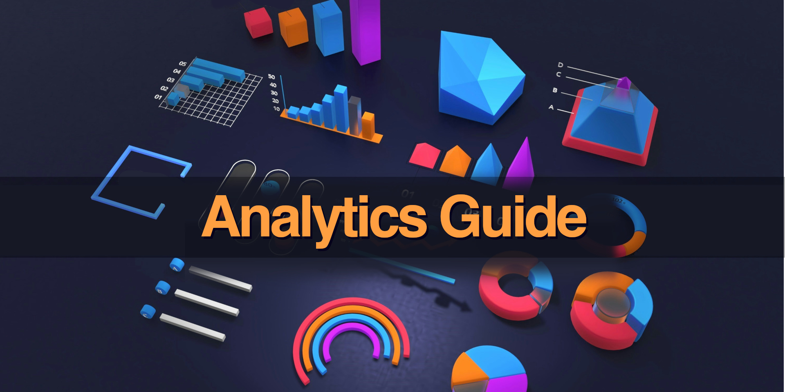

<!--
* browser: analytics-guide
* tracker: 697c43c7eb6bd8458124ed2ec6f8cc5d
* version: 1.0.0
* updated: 2023-07-26T10:54:04Z
* contact: Joel Parker Henderson (http://joelparkerhenderson.com)
* options: commentable
-->

# Analytics Guide

Analytics Guide: this book explains one topic per page, like a big glossary, easy wiki, quick encyclopedia, or summary notes.

- Get the book:
  [Free EPUB](https://github.com/SixArm/analytics-guide/raw/main/analytics-guide.epub),
  [Free PDF](https://github.com/SixArm/analytics-guide/raw/main/analytics-guide.pdf),
  [Gumroad](https://gumroad.com/l/analytics-guide).
- Edited by [Joel Parker Henderson](https://github.com/joelparkerhenderson)
- For questions and suggestions [email me](mailto:joel@joelparkerhenderson.com)

## Contents

### [Introduction](topics/analytics-guide-introduction)

- [What is analytics?](topics/what-is-analytics)
- [What are analytics insights?](topics/what-are-analytics-insights)

### [Analytics areas]

- [Business analytics](topics/business-analytics)
- [Data analytics](topics/data-analytics)
- [Predictive analytics](topics/predictive-analytics)
- [Descriptive analytics](topics/descriptive-analytics)
- [Prescriptive analytics](topics/prescriptive-analytics)
- [Diagnostic analytics](topics/diagnostic-analytics)
- [Geospatial analytics](topics/geospatial-analytics)
- [Cognitive analytics](topics/cognitive-analytics)
- [Exploratory analytics](topics/exploratory-analytics)
- [Embedded analytics](topics/embedded-analytics)

### Data

- [Qualitative data](topics/qualitative-data)
- [Quantitative data](topics/quantitative-data)

- [Structured data](topics/structured-data)
- [Unstructured data](topics/structured-data)

- [True positive](topics/true-positive)
- [False positive](topics/false-positive)
- [True negative](topics/true-negative)
- [False negative](topics/false-negative)

- [Accuracy](topics/accuracy)
- [Precision](topics/precision)

- [Absolutue estimation](topics/absolute-estimation)
- [Relative estimation](topics/relative-estimation)

### [Conclusion](topics/analytics-guide-conclusion)

- [About the editor](topics/about-the-editor)
- [About the AI](topics/about-the-ai)
- [About the ebook](topics/about-the-ebook-pdf)
- [About related projects](topics/about-related-projects)

## All our guides

- [Innovation Partnership Guide](https://github.com/sixarm/innovation-partnership-guide)
- [Startup Business Guide](https://github.com/sixarm/startup-business-guide)
- [Project Management Guide](https://github.com/sixarm/project-management-guide)
- [Analytics Guide](https://github.com/sixarm/analytics-guide)
- [UI/UX Design Guide](https://github.com/sixarm/ui-ux-design-guide)
- [Test Automation Guide](https://github.com/sixarm/test-automation-guide)
- [Software Programming Guide](https://github.com/sixarm/software-programming-guide)
- [AI Starter Guide](https://github.com/sixarm/ai-starter-guide)
- [Business Lingo Guide](https://github.com/sixarm/business-lingo-guide)
